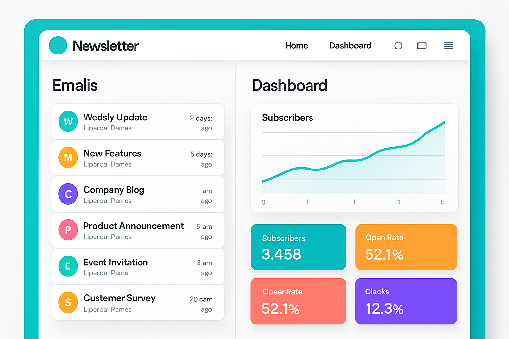

# NewsPulse



## Description

NewsPulse is a modern, fast, and scalable newsletter web application powered by Next.js and Bun. It features seamless user authentication via GitHub, intuitive newsletter creation, and reliable email delivery. The app boasts a sleek, responsive UI built with Tailwind CSS and uses TypeScript for type safety and maintainability. This project emphasizes performance and developer experience through a cutting-edge tech stack.

## Features

- User authentication with GitHub using NextAuth.js
- Newsletter management (creation, editing, sending)
- Subscriber management
- Responsive and modern UI with Tailwind CSS
- Fast development and runtime with Bun
- Secure and scalable backend with Next.js API routes
- Email delivery integration (to be added)

## Tech Stack

- **Frontend & Backend:** Next.js (React framework with server-side rendering)
- **Runtime:** Bun
- **Styling:** Tailwind CSS
- **Authentication:** NextAuth.js with GitHub provider
- **Language:** TypeScript

## Getting Started

### Prerequisites

- [Bun](https://bun.sh/) installed and configured
- GitHub OAuth app credentials (Client ID and Client Secret)
- Node.js (optional, for some tools if needed)

### Installation

1. Clone the repository:

```bash
git clone https://github.com/ayushedith/newspulse.git
cd newspulse
```

2. Install dependencies using Bun:
```bash
bun install
```


3. Create a `.env.local` file with the following environment variables:
```bash
NEXTAUTH_SECRET=your-strong-random-secret
NEXTAUTH_URL=http://localhost:3000

GITHUB_ID=your_github_client_id
GITHUB_SECRET=your_github_client_secret
```

4. Open your browser and navigate to [http://localhost:3000](http://localhost:3000).


## Usage

- Sign in using your GitHub account.
- Access the dashboard to create and manage newsletters.
- Add subscribers and send newsletters (feature to be implemented).
- Customize email templates and settings.

## Contributing

Contributions are welcome! Please follow these steps:

1. Fork the repository.
2. Create a feature branch (`git checkout -b feature-name`).
3. Commit your changes (`git commit -m 'Add feature'`).
4. Push to the branch (`git push origin feature-name`).
5. Open a Pull Request.

## License

This project is licensed under the MIT License.

---

Created with ❤️ using Next.js, Bun, and Tailwind CSS.

